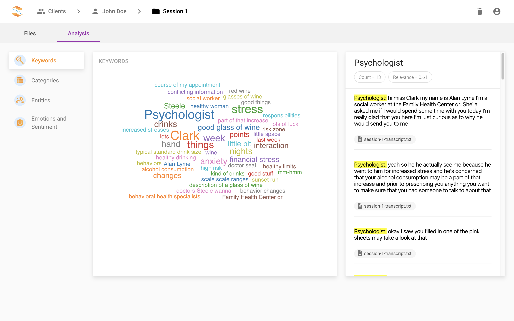
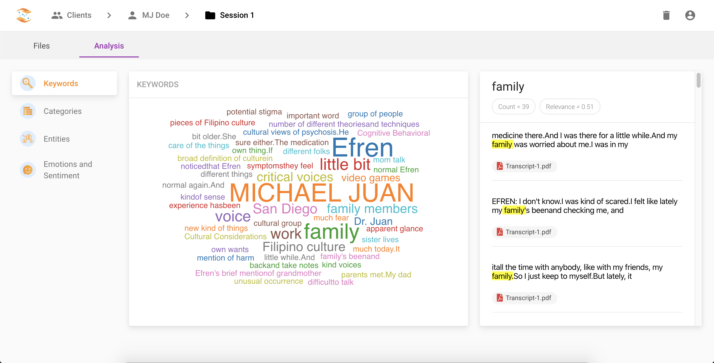
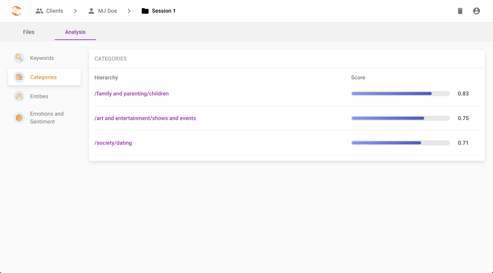
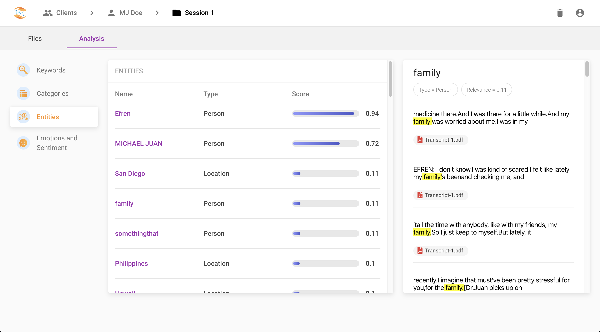
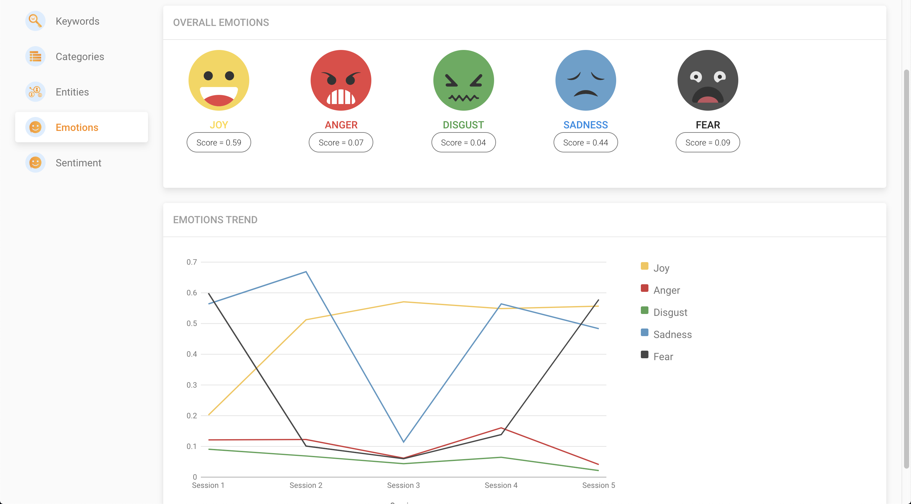
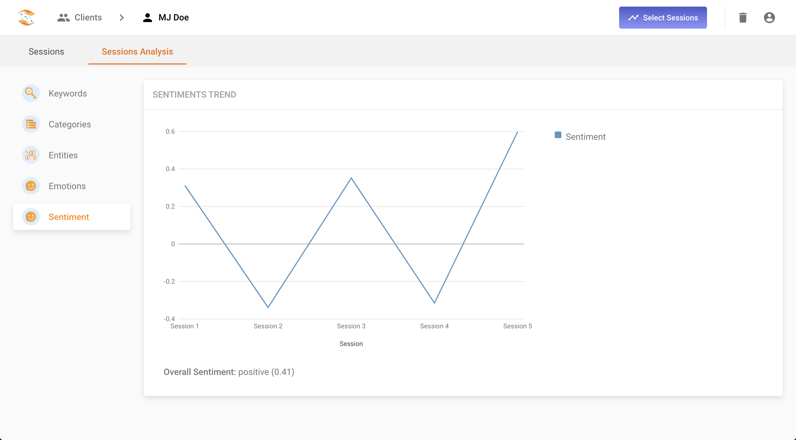
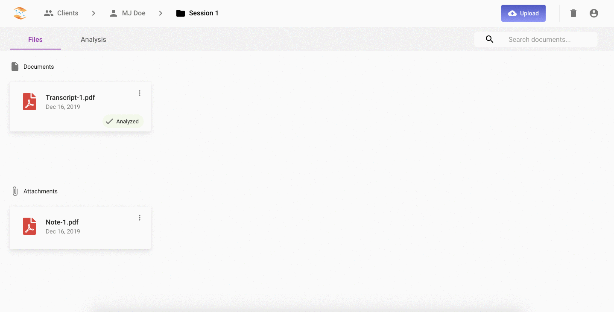
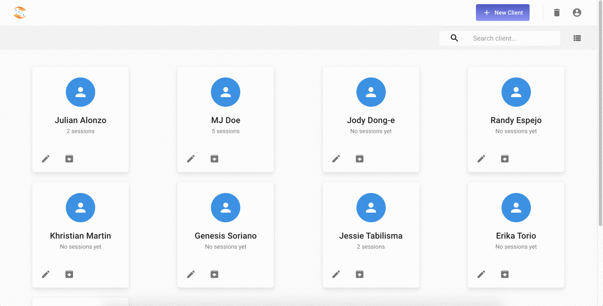

# **kaagapAI**
**kaagapAI** is an automated text analysis tool that aims to assist mental health practitioners in summarizing, analyzing, and managing therapy session documents.

---

## Technologies & Frameworks
  - React
  - Material-UI
  - Node.js
  - GraphQL
  - Apollo Client
  - Apollo Server
  - MySQL & Sequelize
  - JWT

### APIs and Libraries
  - IBM Watson 
    - Natural Language Understanding
    - Knowledge Studio
  - Google Cloud 
    - Cloud Storage
    - Cloud Translation API
    - Cloud Vision API
    - Cloud Speech-to-Text
  - Others
    - FFmpeg
    - textract
    - AntiWord
    - pdftotext

---

## Features
### Document Analysis

kaagapAI uses IBM Watson Natural Language Understanding in order to perform text analysis on session documents (e.g., transcripts and notes). Through text analysis, kaagapAI extracts relevant insights which include keywords, themes or categories, entities, sentiments, and emotional tone. Text analysis can be conducted on a specific session or multiple sessions. Analysis on multiple sessions include data visualizations on sentiment and emotion trends.

IBM Watson Knowledge Studio enables the training of custom models in order to extract domain-specific entities. The original intention was to train a custom model to extract more relevant entities in the mental health field (e.g., mental health disorders or more diversed emotional tones), however, the custom model still lacks training due to time constraints and resources constraints (i.e., lack of annotators and training dataset). kaagapAI is currently using the default model used by NLU.

#### Word Cloud (Keywords)
The word cloud consists of the keywords that occurred multiple times in the document. Clicking on a specific word in the word cloud displays the word count and relevance and finds all search apperances of the word across analyzed documents.

#### Categories
*Categories* shows the hierarchy of themes that were detected in the analyzed documents. These themes were derived from the words that were found in the documents. 

#### Entities
*Entities* classifies words that belong to pre-defined categories. Clicking on a specific entity shows the entity type, relevance, and appearances across analyzed documents.

#### Emotions
*Emotions* rates the detected emotions of analyzed documents according to six basic emotions: joy, anger, disgust, sadness, and fear. In the analysis of multiple sessions, a line graph is used to show the trend of emotions across selected sessions.

#### Sentiment
*Sentiment* scores the overall feel of the session which could be positive, negative, or neutral. Analysis of multiple sessions also shows the trend of sentiments across selected sessions.

### Document Preprocessing
kaagapAI preprocesses uploaded documents in order to extract text from different file formats (i.e., txt, pdf, docx, png, jpg, m4a). 

Cloud Vision API is used to extract text from images, thus making it possible to upload handwritten notes.

Cloud Speech-to-Text API is used to transcribe audio recordings.

After extracting text from uploaded files, the text is translated to English using the Cloud Translation API.

### Client, Session, and Document Management
kaagapAI organizes its data based on the common data organization of mental health practitioners. A client can have multiple sessions, and a session can hold multiple documents. kaagapAI provides CRUD operations in order to manage these entities (i.e., clients, sessions, and documents). kaagapAI also provides ways to manage the analysis of documents. Extracted text from documents can be edited in order to correct anomalies such as lost in translation, mispelled words, and incorrect transcription. Files can be uploaded either as documents or attachments. Documents are files that are included in the analysis by default, while attachments are supporting files that are not excluded in the analysis. Documents can be set to _ignored_ to exclude them from the analysis.

